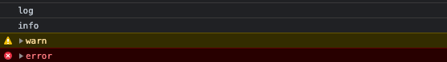
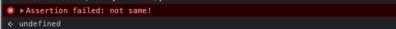
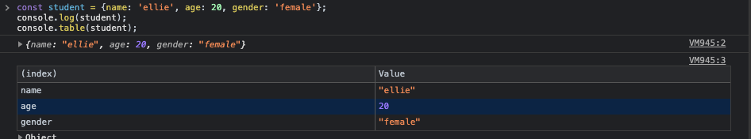

# 4. NODE MODULES

## 4.4. console

### 4.4.1. log level

```javascript
console.log('log');
console.info('info');
console.warn('warn');
console.error('error');
```

위의 console 들은 브라우저 상에서 아래와 같이 나타내진다.



### 4.4.2. assert level
```javascript
console.assert(2===3, 'not same!')
console.assert(2===2, 'same!')
```
console.assert({bool}, {log}) 은 bool 이 거짓일 때만 log 를 출력한다.



```javascript
const student = {name: 'ellie', age: 20, gender: 'female'};
console.log(student);
console.table(student);
```

console.table 은 object 를 좀 더 보기 쉽게 테이블 형태로 출력해 준다.



위에서 제시한 방법 외에도 많은 console 과 관련한 api 들이 존재한다. 필요에 따라 찾아쓰자.

## 4.5. this
```javascript
function hello() {
    // console.log(this);
    console.log(this===global);
}

class A {
    constructor(num){
        this.num = num;
    }
    memberFunction(){
        console.log('----------- class -----------')
        console.log(this)
        console.log(this === global)
    }
}


const a = new A(1);

hello();
a.memberFunction()
console.log(this === module.exports);
```

```
true
----------- class -----------
A { num: 1 }
false
true
```

1. 함수 내의 this : global
2. class 내의 this : class 자기 자신
3. 전역에서의 this(nodejs 환경) : module.exports

## 4.6. module

### 4.6.1. exports-require

**[./app.js]**
```javascript
const counter = require('./counter');

counter.increase();
counter.getCount();
```
**[./counter.js]**
```javascript
let count = 0;

function increase(count) {
    count++
}

function getCount(count) {
    return count;
}

module.exports.getCount = getCount;
module.exports.increase = increase;
```

### 4.6.2. exports-import

**[./package.json]**
```json
{
  "name": "4-module",
  "version": "1.0.0",
  "description": "",
  "main": "app.js",
  "type": "module",
  "scripts": {
    "test": "echo \"Error: no test specified\" && exit 1"
  },
  "author": "",
  "license": "ISC"
}
```
**주의!** :기존의 package.json 파일에서 "type": "module" 부분 추가

**[./app.js]**
```javascript
import { increase, getCount } from "./counter.js";

increase();
getCount();

console.log(getCount());
```
```javascript
import * as counter from "./counter.js";

counter.increase();
counter.getCount();

console.log(counter.getCount());
```
위의 2개의 소스는 완전히 같은 소스이다.

**[./counter.js]**
```javascript
let count = 0;

export function increase() {
    count++
}

export function getCount() {
    return count;
}

```


## 4.10. timer in callStack

```javascript
console.log('code1');
setTimeout(()=>{
    console.log('setTimeout 0');
}, 0);
console.log('code2');
setImmediate(()=>{
    console.log('setImmediate');
});
console.log('code3');
process.nextTick(()=>{
    console.log('process.nextTick');
});
```

```
code1
code2
code3
process.nextTick
setTimeout 0
setImmediate
```

위의 소스에서 기본적으로 함수들이 먼저 실행되고 callback 이 그 이후에 실행된다. 이 떄 nextTick 에 들어가 있는 콜백 함수는 큐 제일 앞자리로 이동시켜서 제일 먼저 실행되게 된다.

## 4.11. path

```javascript
const { normalize } = require('path');
const path = require('path');

// * POSIX (UNIX : mac, Linux): 'Users/temp/myfile.html'
// * WINDOWS : 'C:\\temp\\myfile.html'

console.log(__dirname);
console.log(__filename);

console.log(path.sep);
console.log(path.delimiter);

// basename
console.log(path.basename(__filename));
console.log(path.basename(__filename, '.js'));

// dirname : 해당 파일의 디렉토리 네임을 return 해줌
console.log(path.dirname);

// extention : 해당파일의 확장자를 return 해줌
console.log(path.extname(__filename));


// parse : 파일 경로를 분리하여 json 형태로 출력
const parsed = path.parse(__filename);

console.log(parsed);

const str = path.format(parsed);
console.log(str);

// isAbsolute : 입력값이 절대주소일 때 true, 상대경로일 때 false;
console.log('isAbsolute?', path.isAbsolute(__dirname));
console.log('isAbsolute?', path.isAbsolute('../'));

// normalize : 파일경로에 이상한 문자열들이나 잘못된 경로가 입력되었을 때 수정해 줌
console.log(path.normalize('./folder//////////////sub'));

// join : 기본적으로 경로를 생성하게 될 때 직접 생성하게 되면 운영체제마다 다르게 적용될 수 있기 때문애
//        join, path.sep 을 쓰는 것을 추천한다.
console.log(__dirname + path.sep + 'image');
console.log(path.join(__dirname, 'image'));
```

위의 path 모듈은 필요할 때 찾아서 쓰면 된다. 단 운영체제를 신경을 써 줘야 하기 때문에 join, path.sep 같은 모듈을 쓰는 것이 호환성에 좋다.

## 4.12. file module, async-sync

```javascript
const fs = require('fs');

// * rename sync

try{
    fs.renameSync('./text.txt', './text-new.txt');
}catch(error){
    console.log(error);
}

// * sync, rename

fs.rename('./text-new.txt', './text.txt', (error)=>{
    console.log(error);
})

console.log('hello');

// * promise rename

fs.promises
    .rename('./text2.txt', './text-new/txt')
    .then(()=>console.log('Done!'))
    .catch(console.error)
```

위의 소스에서 동기처리(sync, rename 부분) 은 지양하는 것이 좋다.</br>
동기처리로 진행하게 될 경우 에러가 발생하면 nodejs 가 중단되어 버리기 떄문에 1번째나 3번쨰 방법을 추천한다.

## 4.15. Buffer

```javascript
// Fixed-size chunk of memory
// array of integer, byte of data

const buf = Buffer.from('Hi');  // 문자열을 uniCode 로 decoding 하여 보여줌
console.log(buf);
console.log(buf.length);
console.log(buf.toString()); // unicode 를 encoding 하여 보여줌

```


## 4.16. Stream

서버에서 영상이나 매우 긴 텍스트 같이 용량이 큰 파일을 전송할 때 한번에 보내게 되면 매우 비효율 적이다. 단적인 예로 1시간 짜리 영상에서 사용자가 1분만 보고 싶을 때 1시간 짜리 영상을 통째로 보내주게 되면 심각한 낭비가 발생한다. 이를 보안하기 위해 일정단위로 끊어서 데이터를 보내주는 것이 stream 이다

```javascript
const fs = require('fs');

let chunkNum = 0;
const data = [];

fs.createReadStream('./file.txt', { // 파일을 읽을 stream 해서 가져올 때의 설정값
    highWaterMark: 64, // default : 64 kbytes, 받아올 파일을 끊어읽기할 단위
    encoding: 'utf-8', // 문자열 인코딩의 종류
}).on('data', (chunk)=>{ //
    chunkNum++;
    console.log(chunk);
    // console.count('data')
}).on('end', (data)=>{
    console.log(`================number of chunk : ${chunkNum}====================`);
    console.log("################this is end of this file##############");
}).on('error', (error)=>{
    console.log(error);
})
```

위의 file.txt 의 용량은 `45Mbyte` 이다

1. `.on('chunk', {callback})` : `createReadStream` 에서 지정해준 단위로 끊어올 때 실행됨
2. `.on('end', {callback})` : file reading 끝난 시점에 실행됨
3. `.on('error', {callback})` : file reading, stream 과정에서 에러발생시 실행됨

* 위의 fs 모듈은 각각의 함수들이 모두 자신을 return 하기 때문에 chaining 이 가능하다.

## 4.17. Write Stream

위에서는 파일을 읽어올 때 Streaming 하는 방법에 대해 배웠다. 아래는 이제 파일을 작성할 떄 Streaming 하는 것에 대해 알아볼 것이다.

```javascript

```
